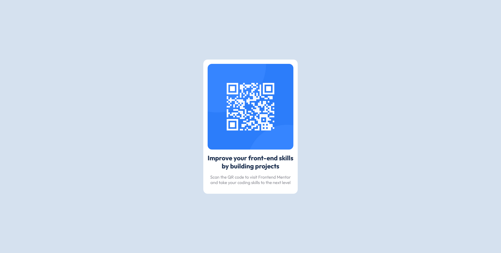

# Frontend Mentor - QR code component solution

This is a solution to the [QR code component challenge on Frontend Mentor](https://www.frontendmentor.io/challenges/qr-code-component-iux_sIO_H).

## Table of contents

  - [Screenshot](#screenshot)
  - [Links](#links)

  - [Built with](#built-with)
  - [My Issues](#my-issues)
- [Author](#author)

### Screenshot

### Links

- Solution URL: [Add solution URL here](https://github.com/Matthew7991/QR-code-component)
- Live Site URL: [Add live site URL here](https://matthew7991.github.io/QR-code-component/)

### Built with

-- Flexbox

### My Issues

I had mainly trouble with getting the colors right, as i didn't know if they had an effect on them and if so which one.

## Author

- Frontend Mentor - [@Matthew7991](https://www.frontendmentor.io/profile/Matthew7991)
